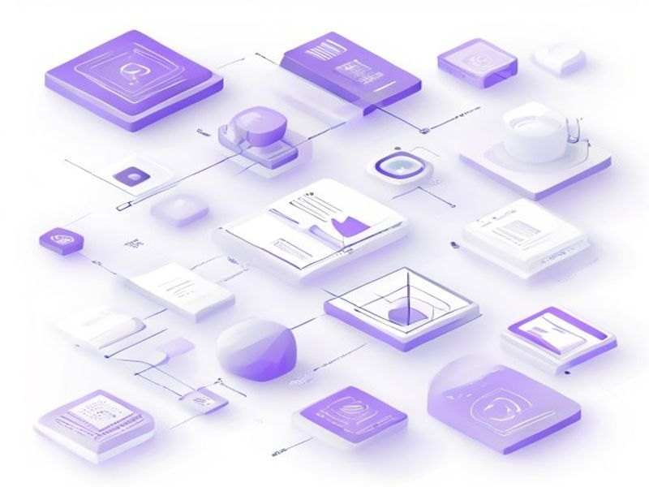

# UI Components Migration - Pure Astro

## TL;DR

**What**: Migrate all React/shadcn UI components to pure Astro `.astro` files.
**Status**: completed | **Priority**: P1
**User Stories**: 4

## Overview

Migrate all React/shadcn UI components to pure Astro `.astro` files. This is Phase 2 of the React→Astro migration.

## Implementation History

| Increment | Status | Completion Date |
|-----------|--------|----------------|
| [0004-ui-components-astro-migration](../../../../../increments/0004-ui-components-astro-migration/spec.md) | ✅ completed | 2026-04-18T00:00:00.000Z |

## User Stories

- [US-001: Migrate Basic Input Components](./us-001-migrate-basic-input-components.md)
- [US-002: Migrate Display Components](./us-002-migrate-display-components.md)
- [US-003: Migrate Interactive Components](./us-003-migrate-interactive-components.md)
- [US-004: Delete Old React Components](./us-004-delete-old-react-components.md)
