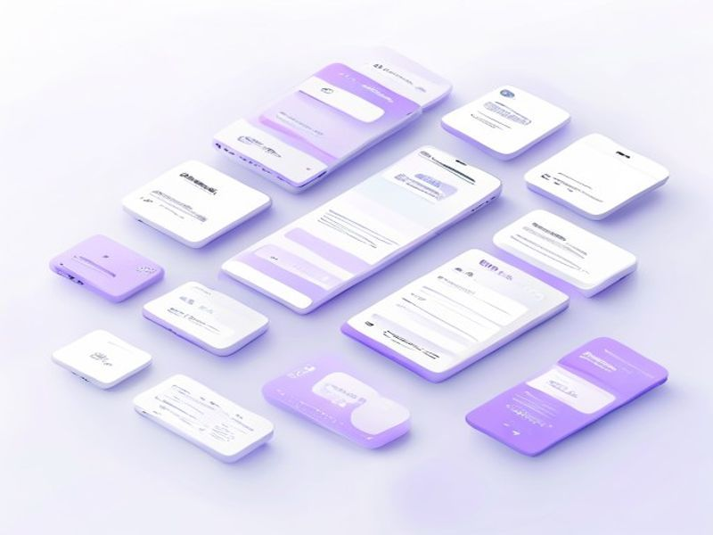

# Mobile UI/UX Optimization

## TL;DR

**What**: Optimi.
**Status**: completed | **Priority**: P1
**User Stories**: 0

## Overview

Optimi

## Implementation History

| Increment | Status | Completion Date |
|-----------|--------|----------------|
| [0017-mobile-ui-optimization](../../../../../increments/0017-mobile-ui-optimization/spec.md) | ✅ completed | 2026-05-07 |
