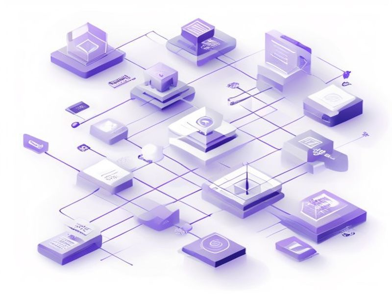

# Role-Based Auth System Fixes

## TL;DR

**What**: Role-Based Auth System Fixes
**Status**: planned | **Priority**: P1
**User Stories**: 6

## Implementation History

| Increment | Status | Completion Date |
|-----------|--------|----------------|
| [0029-role-based-auth](../../../../../increments/0029-role-based-auth/spec.md) | ⏳ planned | 2026-05-07 |

## User Stories

- [US-001: Permission Model Definition](./us-001-permission-model-definition.md)
- [US-002: Role-Based Admin Sidebar](./us-002-role-based-admin-sidebar.md)
- [US-003: Role Management UI](./us-003-role-management-ui.md)
- [US-004: Sign-Up Page](./us-004-sign-up-page.md)
- [US-005: Admin Override for Ownership Checks](./us-005-admin-override-for-ownership-checks.md)
- [US-006: Route-Level Permission Guards](./us-006-route-level-permission-guards.md)
