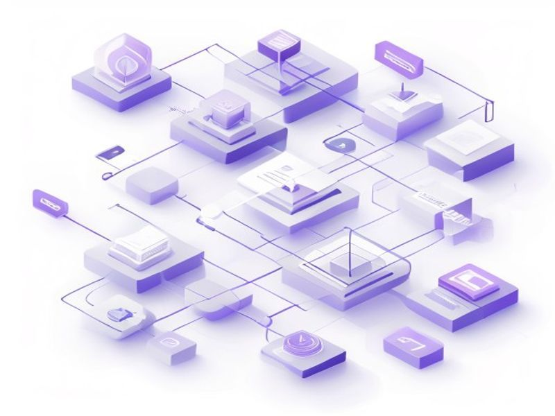

# Subscription Workflow

## TL;DR

**What**: Subscription Workflow
**Status**: completed | **Priority**: P1
**User Stories**: 7

## Implementation History

| Increment | Status | Completion Date |
|-----------|--------|----------------|
| [0030-subscription-workflow](../../../../../increments/0030-subscription-workflow/spec.md) | ✅ completed | 2026-05-07T00:00:00.000Z |

## User Stories

- [US-001: One Listing Per User](./us-001-one-listing-per-user.md)
- [US-002: Non-Profit Listing (Free, Immediate)](./us-002-non-profit-listing-free-immediate.md)
- [US-003: Business Listing Requires Subscription](./us-003-business-listing-requires-subscription.md)
- [US-004: SKU Creation After Activation](./us-004-sku-creation-after-activation.md)
- [US-005: Grace Period (60 Days)](./us-005-grace-period-60-days.md)
- [US-006: Subscription Expiry Sync](./us-006-subscription-expiry-sync.md)
- [US-007: Scheduled Cleanup Job](./us-007-scheduled-cleanup-job.md)
