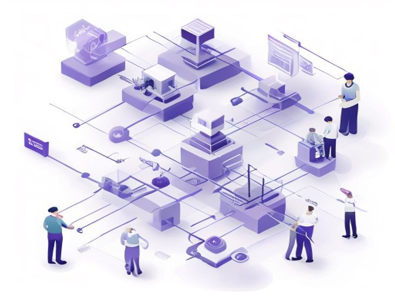

# Mastra + CF Workers AI Integration

## TL;DR

**What**: Enhance Mastra with CF Workers AI fallback, unified provider config.
**Status**: completed | **Priority**: P1
**User Stories**: 3

## Overview

Enhance Mastra with CF Workers AI fallback, unified provider config.

## Implementation History

| Increment | Status | Completion Date |
|-----------|--------|----------------|
| [0035-mastra-workers-ai](../../../../../increments/0035-mastra-workers-ai/spec.md) | ✅ completed | 2026-05-07 |

## User Stories

- [US-001: Unified Provider Config](./us-001-unified-provider-config.md)
- [US-002: CF Workers AI Fallback](./us-002-cf-workers-ai-fallback.md)
- [US-003: Agent Tools](./us-003-agent-tools.md)
