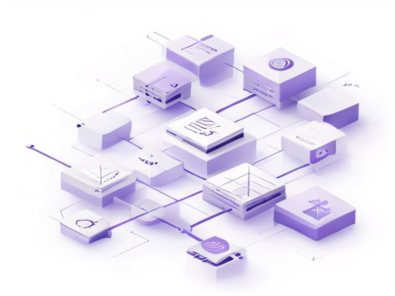

# Admin Auth Cookie + Middleware

## TL;DR

**What**: Replace insecure localStorage admin auth with httpOnly cookie-based sessions.
**Status**: completed | **Priority**: P1
**User Stories**: 3

## Overview

Replace insecure localStorage admin auth with httpOnly cookie-based sessions. Create Astro middleware for centrali

## Implementation History

| Increment | Status | Completion Date |
|-----------|--------|----------------|
| [0049-0040-admin-auth-cookie-middleware](../../../../../increments/0049-0040-admin-auth-cookie-middleware/spec.md) | ✅ completed | 2026-05-13T00:00:00.000Z |

## User Stories

- [US-001: Admin Cookie Session (P1)](./us-001-admin-cookie-session-p1.md)
- [US-002: Centralized Auth Middleware (P1)](./us-002-centralized-auth-middleware-p1.md)
- [US-003: AdminLayout Auth (P1)](./us-003-adminlayout-auth-p1.md)
