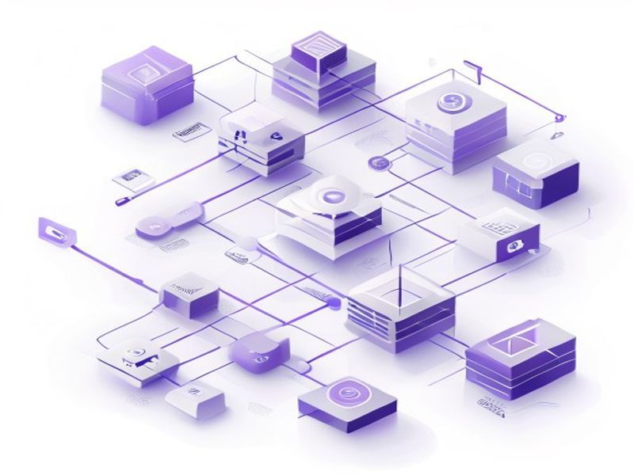

# Better Auth KV Session Cache

## TL;DR

**What**: Configure Better Auth secondaryStorage with KV for faster session lookups.
**Status**: completed | **Priority**: P1
**User Stories**: 2

## Overview

Configure Better Auth secondaryStorage with KV for faster session lookups. Sessions currently stored only in D1 (slow), KV cache reduces read latency.

## Implementation History

| Increment | Status | Completion Date |
|-----------|--------|----------------|
| [0051-0042-better-auth-kv-session](../../../../../increments/0051-0042-better-auth-kv-session/spec.md) | ✅ completed | 2026-05-13T00:00:00.000Z |

## User Stories

- [US-001: KV Session Cache (P1)](./us-001-kv-session-cache-p1.md)
- [US-002: Cache Invalidation (P1)](./us-002-cache-invalidation-p1.md)
