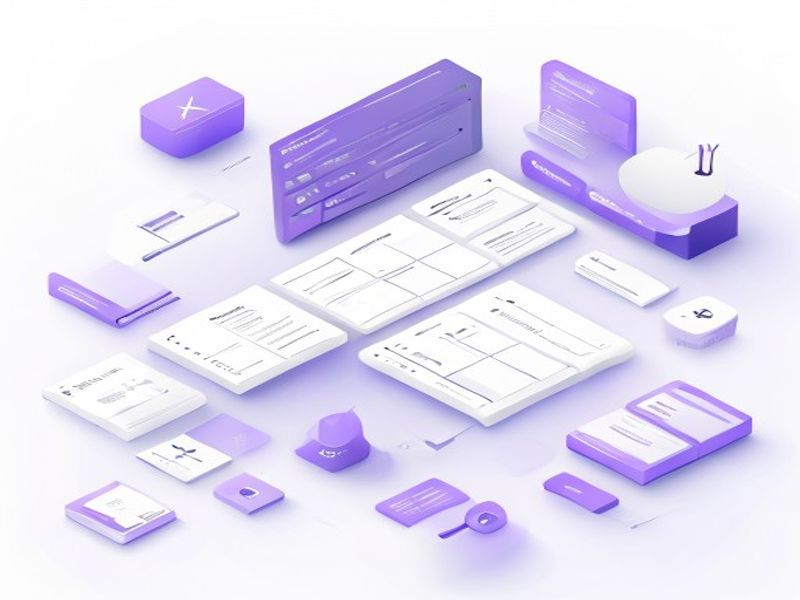

# TipTap Rich Text Editor Integration

## TL;DR

**What**: Integrate TipTap framework-agnostic rich text editor for blog posts and business about-us content.
**Status**: completed | **Priority**: P1
**User Stories**: 3

## Overview

Integrate TipTap framework-agnostic rich text editor for blog posts and business about-us content. Replaces static textareas with a WYSIWYG editor supporting headings, lists, bold, italic, and links.

## Implementation History

| Increment | Status | Completion Date |
|-----------|--------|----------------|
| [0005-tiptap-rich-editor](../../../../../increments/0005-tiptap-rich-editor/spec.md) | ✅ completed | 2026-04-18T00:00:00.000Z |

## User Stories

- [US-001: Blog Content Editing (P1)](./us-001-blog-content-editing-p1.md)
- [US-002: Business About-Us Editing (P1)](./us-002-business-about-us-editing-p1.md)
- [US-003: Editor Integration (P1)](./us-003-editor-integration-p1.md)
