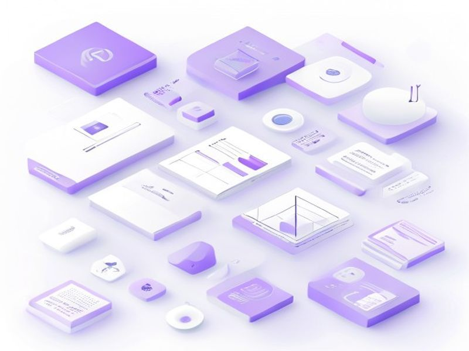

# UI Color & Layout Refresh

## TL;DR

**What**: Unified UI styling across frontend and backend based on design reference screenshots - dark theme, golden yellow primary (#FFD700), enhanced cards, improved search, pill-style tags, admin sidebar.
**Status**: completed | **Priority**: P1
**User Stories**: 7

## Overview

Unified UI styling across frontend and backend based on design reference screenshots - dark theme, golden yellow primary (#FFD700), enhanced cards, improved search, pill-style tags, admin sidebar.

## Implementation History

| Increment | Status | Completion Date |
|-----------|--------|----------------|
| [0008-ui-refresh](../../../../../increments/0008-ui-refresh/spec.md) | ✅ completed | 2026-04-19T00:00:00.000Z |

## User Stories

- [US-001: Unified Color Theme (P1)](./us-001-unified-color-theme-p1.md)
- [US-002: Dark Theme Background (P1)](./us-002-dark-theme-background-p1.md)
- [US-003: Enhanced Card Styling (P1)](./us-003-enhanced-card-styling-p1.md)
- [US-004: Improved Search Design (P1)](./us-004-improved-search-design-p1.md)
- [US-005: Pill-Style Category Tags (P2)](./us-005-pill-style-category-tags-p2.md)
- [US-006: Admin Sidebar Navigation (P1)](./us-006-admin-sidebar-navigation-p1.md)
- [US-007: Unified Typography (P2)](./us-007-unified-typography-p2.md)
