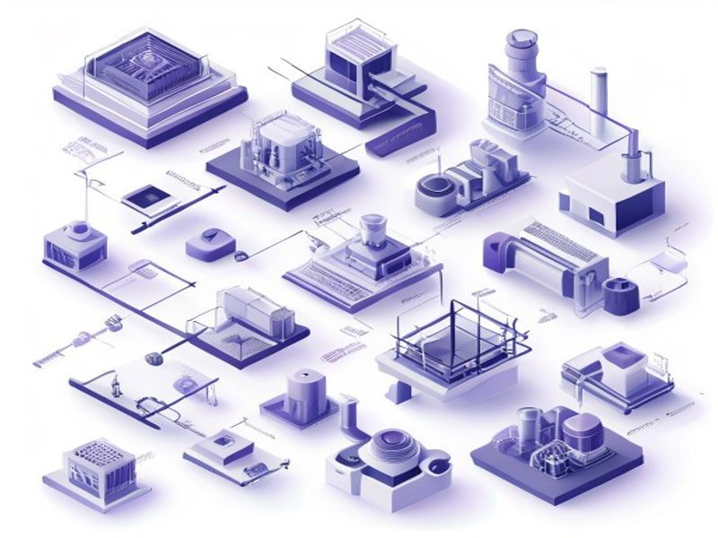

# Descriptive Industry Images

## TL;DR

**What**: Replace emoji icons with descriptive images for industry categories.
**Status**: completed | **Priority**: P1
**User Stories**: 2

## Overview

Replace emoji icons with descriptive images for industry categories. Images should be small/compact (thumbnail si

## Implementation History

| Increment | Status | Completion Date |
|-----------|--------|----------------|
| [0010-descriptive-industry-images](../../../../../increments/0010-descriptive-industry-images/spec.md) | ✅ completed | 2026-04-19T00:00:00.000Z |

## User Stories

- [US-001: Industry Image Display (P1)](./us-001-industry-image-display-p1.md)
- [US-002: Admin Image Upload (P1)](./us-002-admin-image-upload-p1.md)
