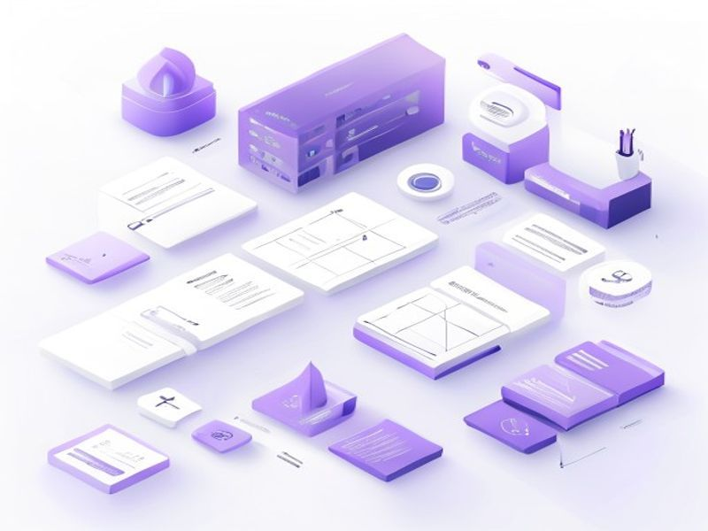

# Admin Sidebar Unified Theme

## TL;DR

**What**: Fix admin sidebar dark/light theme sync and integrate sidebar with content area.
**Status**: completed | **Priority**: P1
**User Stories**: 3

## Overview

Fix admin sidebar dark/light theme sync and integrate sidebar with content area. The sidebar already exists in AdminLayout.astro but has three issues: (1) theme toggle doesn't sync properly between sidebar and content, (2) inconsistent styling across admin pages, and (3) mobile-responsive sidebar behavior needs improvement.

## Implementation History

| Increment | Status | Completion Date |
|-----------|--------|----------------|
| [0012-admin-sidebar-unified](../../../../../increments/0012-admin-sidebar-unified/spec.md) | ✅ completed | 2026-04-19T00:00:00.000Z |

## User Stories

- [US-001: Theme Toggle Sync](./us-001-theme-toggle-sync.md)
- [US-002: Consistent Admin Styling](./us-002-consistent-admin-styling.md)
- [US-003: Mobile Sidebar UX](./us-003-mobile-sidebar-ux.md)
