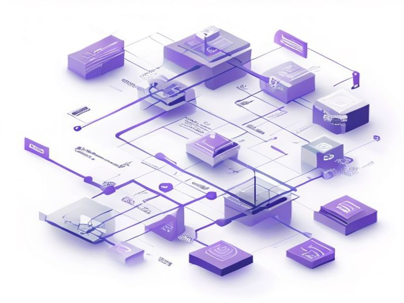

# Code Quality Cleanup P0

## TL;DR

**What**: 修复 4 类技术债：.
**Status**: completed | **Priority**: P0
**User Stories**: 4

## Overview

修复 4 类技术债：
1. **P0 安全风险** - API key 在 console.log 中泄露
2. **P0 静默错误** - 52 处空 catch 块，用户无反馈
3. **P1 类型安全** - 10 处 `as any` 掩盖 Worker binding 配置错误
4. **P1 攻击面** - 11 个冗余 REST API 端点（已被 Server Actions 替代）

## Implementation History

| Increment | Status | Completion Date |
|-----------|--------|----------------|
| [0058-code-quality-cleanup-p0](../../../../../increments/0058-code-quality-cleanup-p0/spec.md) | ✅ completed | 2026-05-15T00:00:00.000Z |

## User Stories

- [US-001: 修复空 catch 块导致的静默错误](./us-001-catch.md)
- [US-002: 移除生产环境 console.log 泄露](./us-002-console-log.md)
- [US-003: 替换 as any 类型断言](./us-003-as-any.md)
- [US-004: 删除冗余 REST API 端点](./us-004-rest-api.md)
